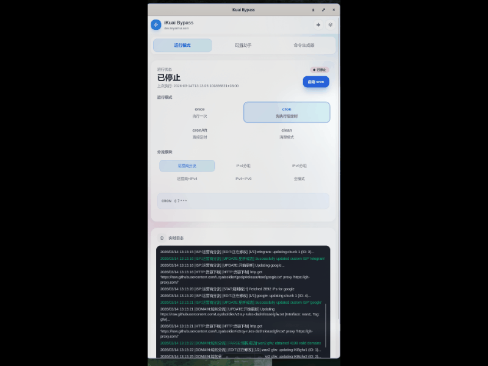

# iKuai-Toolbox

  

> **项目声明 / Fork Notice**：本仓库 **iKuai-Toolbox** 是 [joyanhui/ikuai-bypass](https://github.com/joyanhui/ikuai-bypass)（AGPL-3.0）的独立修改版本，自 2026-08 起由 [FelixJI](https://github.com/FelixJI) 维护并更名。依据 AGPL-3.0 第 5(a) 条，特此声明本作品包含对原项目的修改；完整版权与修改声明见 [NOTICE](NOTICE) 与 [LICENSE](LICENSE)。

**iKuai-Toolbox** 是一款爱快路由器专用的分流规则自动同步工具。它可以自动从网上下载 IP/域名列表并同步到你的路由器，让你的流量自动走正确的线路。比如：主流网站和国内ip流量通过光猫直连、特殊流量走旁路由/网关，可以自动同步更新并兼容手动维护的其他分流规则。

提供三种安装方式：
- **GUI**：图形化工具支持桌面和手机 App，支持 Windows / macOS / Linux 和 Android / iOS
- **CLI**：命令行 + 可选 WebUI，适合 服务器/OpenWrt / NAS / PVE / Docker 等部署
- **LuCI 面板**：OpenWrt 用户可通过 LuCI WebUI 管理，IPK 一键安装

> **版本选择**：爱快 v3.7x 请用上游 [v4.2.0](https://github.com/joyanhui/ikuai-bypass/releases/tag/v4.2.0)。旧版 Go 已归档至上游 [v4.4.13](https://github.com/joyanhui/ikuai-bypass/releases/tag/v4.4.13)。老用户升级请阅读[升级指南](https://joyanhui.github.io/ikuai-bypass/v4.4.13-update-to-v4.4.10x)。

---

## 快速导航

| 分类 | 文档链接 |
|:---|:---|
| 🚀 **入门指南** | [功能特性、下载配置、CLI 运行、WebUI/GUI](https://joyanhui.github.io/ikuai-bypass/quickstart)（上游文档） |
| 🔀 **分流模式** | [自定义运营商 vs IP 分组模式详解](docs/router-mode.md) |
| ⚡ **CLI 参数** | [运行模式、分流模式、清理参数](docs/cli-params.md) |
| 📦 **部署方式** | [Docker / CLI / OpenWRT / ipkg 全场景覆盖](docs/deployment.md) |
| 📖 **更新日志** | [版本历史与变更记录](docs/updatelog.md) |
| 📚 **完整文档** | [文档首页](https://joyanhui.github.io/ikuai-bypass/)（上游文档） |

## 快速开始

> 📖 安装教程详见[快速上手](https://joyanhui.github.io/ikuai-bypass/quickstart.html#一键安装)（上游文档），包含：
> - Linux CLI 服务一键安装
> - OpenWrt LuCI 面板安装
> - Docker / GUI 部署
> - 配置、运行与详情

## 交流与反馈

- Bug 反馈与功能请求：[GitHub Issues](https://github.com/FelixJI/iKuai-Toolbox/issues)
- 欢迎 PR，Rust/TS 代码请须严格遵循零 Clone、零隐式 Panic 及零 Any 原则。

## 上游项目与致谢

- 本项目基于 [joyanhui/ikuai-bypass](https://github.com/joyanhui/ikuai-bypass) 修改而来，感谢原作者 [joyanhui](https://github.com/joyanhui) 的开源贡献。如需支持原作者或参与上游社区，请访问上游仓库（含 [Discussions](https://github.com/joyanhui/ikuai-bypass/discussions) 与 [Telegram 电报群](https://t.me/+cosAS1HgFOtlMTc1)）。
- 同时感谢 [ztc1997](https://github.com/ztc1997/ikuai-bypass/) 的初始版本思路，以及所有 PR 贡献者。

## 许可证

本项目采用 [GNU AGPL-3.0](LICENSE) 授权（与上游一致）。任何人可以自由使用、修改和分发本软件，但修改版必须同样以 AGPL-3.0 完整开源，并保留版权与修改声明（见 [NOTICE](NOTICE)）。通过网络向他人提供本软件服务时，须向用户提供获取对应源码的途径。
